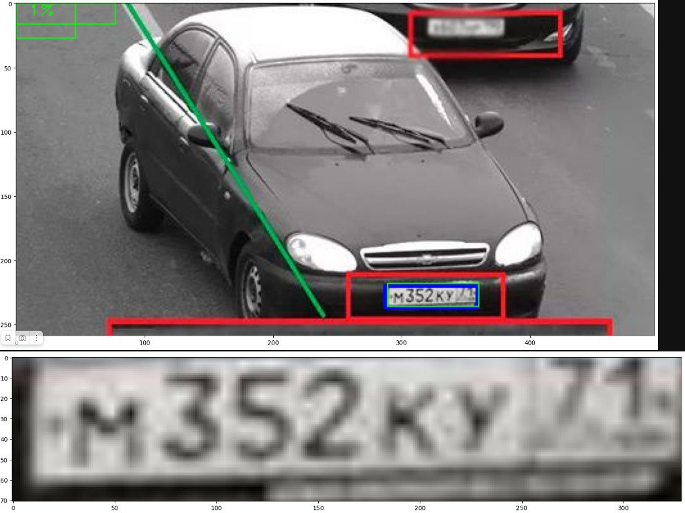
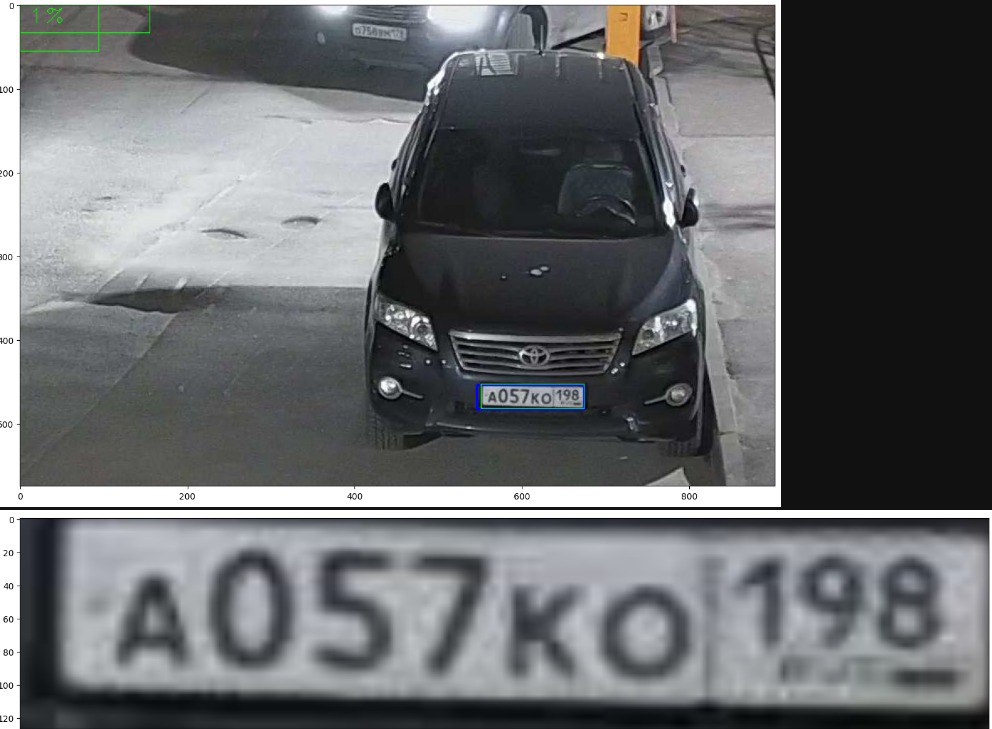
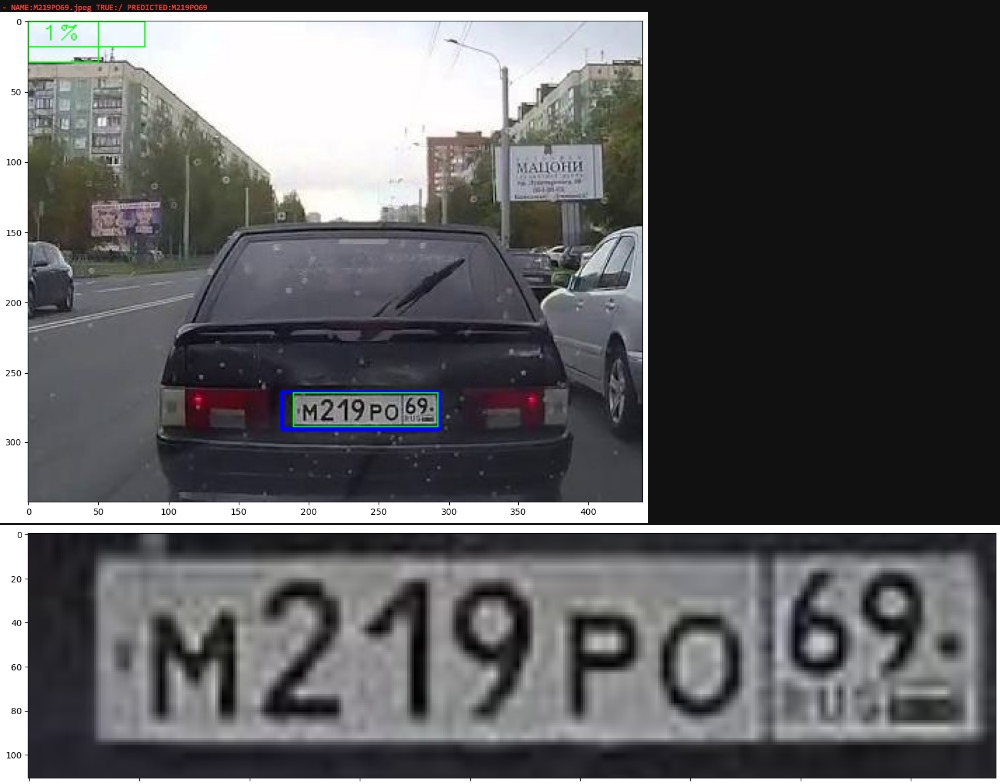

# Detect Znak by IIR

### Project: 
Sign Detection with Nomeroff-Net

### Authors:

#### [dolganin](https://github.com/dolganin) 
#### [RubyRode](https://github.com/RubyRode)

#### Milaev Denis

#### Pimonov Antom

##### Institution: Novosibirsk State University (NSU)

# Description:

This project aims to develop a system for detecting traffic signs using the Nomeroff-Net fine-tuned network. The system is currently almost finished,
has a Telegram @CarZnak_bot

# Getting Started:

To run the project, clone the repository and install the required dependencies:
```bash
git clone https://github.com/dolganin/detect_znak.git

cd detect_znak

pip3 install -r requirements.txt
```

Inference:
To perform inference on an image, follow the following text:
``` Python
from nomeroff_net import pipeline
"""
На выбор из пайплайнов: 
number_plate_classification
number_plate_key_points_detection
number_plate_localization
number_plate_short_detection_and_reading
etc

Загрузчик изображений также есть из opencv, однако лучше использовать turbo для эффективности
"""
number_plate_detection_and_reading = pipeline("multiline_number_plate_detection_and_reading", 
                                              image_loader="turbo")

image_paths = glob("change_to_your_directory_with_images_to_proccess")
              
result = number_plate_detection_and_reading(image_paths, quality_profile=[3, 1, 0])

 """
 Большинство переменных - отладочные, использовать необходимо в основном images и texts: images представляет собой
 список изображений, на которых уже отмечены bboxы, images_zones эти самые вырезанные области bboxов. texts - список списков. Количество списков
 равно количеству изображений, в каждом списке может быть несколько номеров. 
 """

(images, images_bboxs, 
 images_points, images_zones, region_ids, 
 region_names, count_lines, 
 confidences, texts) = unzip(result)

```
#### Training:

You can try to train your model with ocr-ru-train.ipynb.

#### Label format: https://www.robots.ox.ac.uk/~vgg/software/via/

### Results:





### References:

Nomeroff-Net: https://github.com/ria-com/nomeroff-net